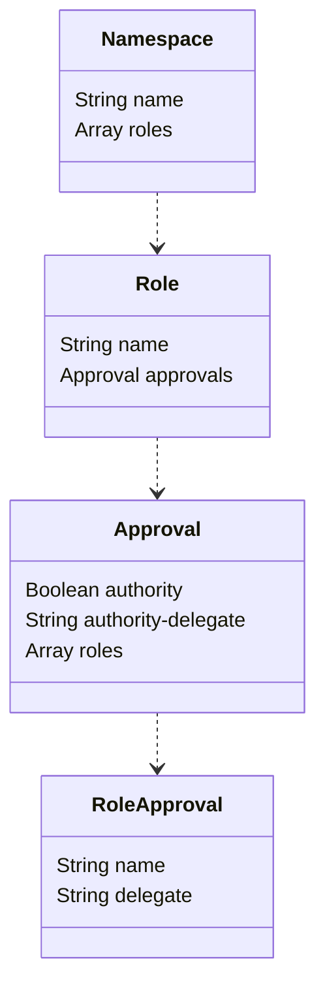
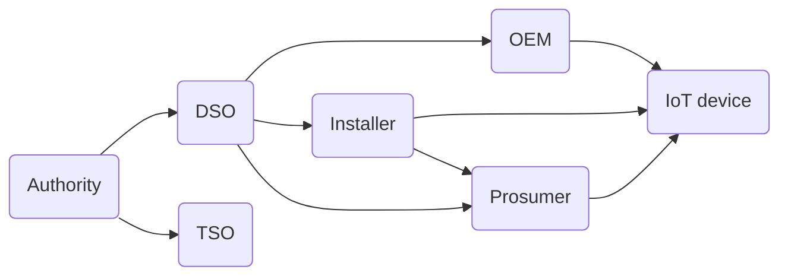
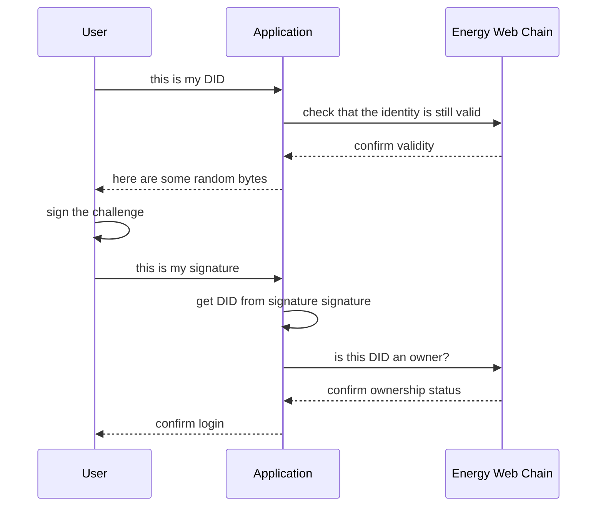
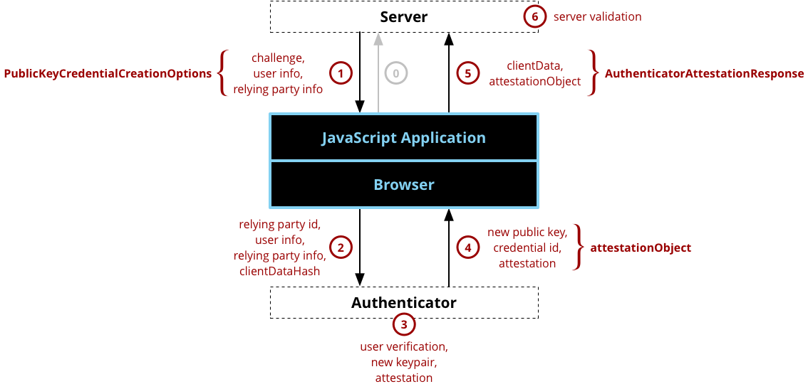

# Role based access for EW-DID

DIDs can be used for authentication very easily but in order to use them for authorization, we need first to agree on how to make the role claims verifiable. 

## Overview of roles as claims

A role is encoded in a claim and can be found in the DID document which can be resolved by using the EW-DID library's resolver. Once the claim has been found in the DID-Document, the program has to verify the
validity of the claim.

A claim for a role is valid if it was approved by all `the right DIDs`. The rules to determine who are `the right DIDs` are not part of the DID specification and hence are the subject of this document.

## Role definitions building blocks

A role is defined by the following components:
* Name space - because a role must be universally unique, it needs a name space to differentiate it from
other, identically named roles
* Approvers - the user should probably not be able to determine their own roles, hence the claim must be
approved by another DID

The name space must be added into a smart-contract so as to enable a trusted source of information for:
* The fully qualified name of the name space
* The parent of the name space. This may be empty in case of the root name space
* The list of root authorities valid for the name space

The approvers can be of 2 kinds:
* A DID who has a claim to a specific role - e.g. only admins can approve new users
* A root authority - specific DIDs must not be used in a role definition as it would be cumbersome to
update all the claims if a DID is invalidated

## Using ENS for name spaces

As we already have a solution for creating and managing names on the EWC, the most convenient solution is
to use it for name spacing the roles. In order to be a valid role name space, an ENS name must point to a
smart contract which implements the correct interface:
```javascript
contract NameSpace is Owned {
    address[] authorities;
    // the URL to the JSON of the roles definitions for this name space e.g. ipfs://QmcMN2wqoun88SVF5own7D5LUpnHwDA6ALZnVdFXhnYhAs
    string roles;
    // access level ownerOnly
    function addAuthority(address authority) public {}
    // access level ownerOnly
    function removeAuthority(address authority) public {}
    // access level authorityOnly
    function setRoles(string memory url) public{}
    // in order to retire a namespace it should be removed access level ownerOnly
    function destroy() public{}
}
```

This requires a separate smart contract for every name space which is probably OK from a resource consumption point of view.

In order to make sure that all the smart contracts referred to by ENS comply with the same interface and security requirements, we could create a factory contract who creates and references name space contracts:

```javascript
contract NameSpaceFactory {
    // map keccak256 hashes of name space to the name space contract
    mapping(bytes32 => address) nameSpaces;
    // the factory will instantiate a new NameSpace contract and set the owner to the sender of the message - access level public
    function addNameSpace(string memory name) public;
}
```

Having this registry of valid name spaces would make it easier to check if a name space can be trusted. We could also implement `ERC165 Standard Interface Detection` but this would merely guarantee that
the functions are present, not that they are implemented correctly.

## Role definition format

A role can be defined in a JSON document. This makes it easy to store in a document database and be
serialized and deserialized for RPC usage.

The EWC flexhub has a list of roles which require approval in order to be valid.


### Namespace

The `Namespace` is the root element. It has only a name attribute which must contain the fully qualified ENS name. E.g. `flexhub.roles.did.ewc.eth`

In addition to the name, the `Namespace` contains the list of roles.

### Role

Each role's FQN is composed of the the role name and namespace. E.g. `dso.flexhub.roles.did.ewc.eth`

In addition to the name, the role contains the list of pprovals required to verify the validity of the role. When a user claims to have a certain role, it must be able to produce all the proofs listed in the `approvals` array.

### Approval

The `Approval` is the actual definition of the validity of the role. It contains the list of entities which must have signed the claim which is presented in order for the application to accept the claim as valid.

#### Authority

The boolean `authority` attribute specifies if the claim must be signed by one of the DIDs listed in the `authorities` array in the `Namesspace` smart contract.

#### Authority-delegate

The `authority-delegate` attribute contains the `delegation type` a delegate must have in order to be allowed to sign the claim as a delegate of one of the authorities. The `issuer` of the claim must thus be able to provide the proof that the `approver` is indeed a delegate of one of the authorities and has the correct delegation type.

#### Roles Approval

The `roles` attribute contains the list of roles which the approvers must have. There must be at least one valid approval by a DID with the correct role for each of the roles in the list for the claim to be considered valid.

### RoleApproval

This class describes the role `name` which must be held by an approver in order for a claim to hold a role to be valid.

The claim can also be approved by a delegate of a DID with the correct role. In this case, the delegation type must correspond to the `delegate` attribute

### Examples

The following examples show how the roles for the flexhub (namespace `flexhub.roles.did.ewc.eth`) are defined.



This diagram shows why we need to share trust and be able to validate roles approved by others. Indeed, if a TSO wants to talk to an IoT Device, it must trust the approvals from the DSO, OEM, Installer and Prosumer whom they have no relationship with.

### TSO and DSO

The first roles are the DSO and TSO which represent the first level after the root authority. They require
approval by the authority and nothing else.

```json
{
    "namespace": "flexhub.roles.did.ewc.eth",
    "roles": [
    {
        "role_name": "tso",
        "approvals": {
            "authority": true,
            "authority-delegate": "signer",
            "roles": []
        }
    },
    {
        "role_name": "dso",
        "approvals": {
            "authority": true,
            "authority-delegate": "signer",
            "roles": []
        }
    }]
}

```

### Installer

In order to act as an installer, an electrician must have received approval from the DSO. Each DSO might
require that the installer has gotten approval from them specifically.
```json
{
    "role_name": "installer",
    "approvals": {
        "authority": false,
        "roles": [
            {"name": "dso", "delegate": "signer"}
        ]
    }
}
```

### OEM
The OEM is the manufacturer of the IoT devices which get installed in the flexhub. It needs to be approved so
as to create a trust relationship between the OEM and the flexhub users.
```json
{
    "namespace": "flexhub.roles.did.ewc.eth",
    "role_name": "oem",
    "approvals": {
        "authority": true,
        "authority-delegate": "signer",
        "roles": [
            {"name": "dso", "delegate": "signer"},
            {"name": "tso", "delegate": "signer"}
        ]
    }
}
```

### IoT

Each IoT device has an identity on the network and must be enabled to act as a device. It must be able to
prove that its OEM is approved and that it has been installed correctly and that it can communicate with the DSO.
```json
{
    "namespace": "flexhub.roles.did.ewc.eth",
    "role_name": "iot_device",
    "approvals": {
        "authority": false,
        "roles": [
            {"name": "oem", "delegate": "signer"},
            {"name": "installer", "delegate": "signer"}
            {"name": "dso", "delegate": "signer"}
        ]
    }
}
```

## Authentication and Authorization

In this document we describe a Roles Based Authorization scheme. This means that every user's permissions in an application are determined by the roles which were assigned to the user.

Authentication is the part of the process where the application verifies who tries to connect to it and if their claim to this identity is legitimate.

Authorization is when the application determines which roles the user has or was given. In the case of SSI, role membership is not an information that the application holds, it is something that the identity can prove. Hence the ability to share roles among applications.

### Authentication

Authentication boils down to verifying that the party connecting to an application is in possession of the private key that owns the identity it wants to connect as. The sequence of events of the happy path is



### Authorization


### Web Authentication API

In the spirit of not reinventing the wheel, we will base the authentication method on the `Web Authentication` API. The process looks like this



On the plus side, it will be easy to create a plugin that mocks the `Authenticator` and provides a DID compliant proof of authorization.

On the negative side, this API is still experimental and not regarded as [production ready on any browser](https://caniuse.com/#feat=mdn-api_webauthentication)
