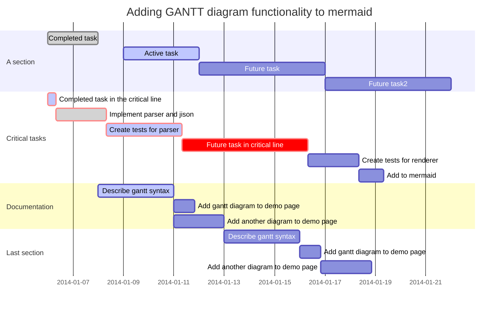

# Role based access for EW-DID

DIDs can be used for authentication very easily but in order to use them for authorization, we need first to agree on how to make the role claims verifiable. 

## Overview of roles as claims

A role is encoded in a claim and can be found in the DID document which can be resolved by using the EW-DID library's resolver. Once the claim has been found in the DID-Document, the program has to verify the
validity of the claim.

A claim for a role is valid if it was approved by all `the right DIDs`. The rules to determine who are `the right DIDs` are not part of the DID specification and hence are the subject of this document.

## Role definitions building blocks

A role is defined by the following components:
* Name space - because a role must be universally unique, it needs a name space to differentiate it from
other, identically named roles
* Approvers - the user should probably not be able to determine their own roles, hence the claim must be
approved by another DID

The name space must be added into a smart-contract so as to enable a trusted source of information for:
* The fully qualified name of the name space
* The parent of the name space. This may be empty in case of the root name space
* The list of root authorities valid for the name space

The approvers can be of 2 kinds:
* A DID who has a claim to a specific role - e.g. only admins can approve new users
* A root authority - specific DIDs must not be used in a role definition as it would be cumbersome to
update all the claims if a DID is invalidated

## Using ENS for name spaces

As we already have a solution for creating and managing names on the EWC, the most convenient solution is
to use it for name spacing the roles. In order to be a valid role name space, an ENS name must point to a
smart contract which implements the correct interface:
```
contract NameSpace is Owned {
    address[] authorities;
    // the URL to the JSON of the roles definitions for this name space e.g. ipfs://QmcMN2wqoun88SVF5own7D5LUpnHwDA6ALZnVdFXhnYhAs
    string roles;
    // access level ownerOnly
    function addAuthority(address authority) public;
    // access level ownerOnly
    function removeAuthority(address authority) public;
    // access level authorityOnly
    function setRoles(string memory url) public;
    // in order to retire a namespace it should be removed access level ownerOnly
    function destroy() public;
}
```

This requires a separate smart contract for every name space which is probably OK from a resource consumption point of view.

In order to make sure that all the smart contracts referred to by ENS comply with the same interface and security requirements, we could create a factory contract who creates and references name space contracts:

```javascript
contract NameSpaceFactory {
    // map keccak256 hashes of name space to the name space contract
    mapping(bytes32 => address) nameSpaces;
    // the factory will instantiate a new NameSpace contract and set the owner to the sender of the message - access level public
    function addNameSpace(string memory name) public;
}
```

Having this registry of valid name spaces would make it easier to check if a name space can be trusted. We could also implement `ERC165 Standard Interface Detection` but this would merely guarantee that
the functions are present, not that they are implemented correctly.

## Role definition format

A role can be defined in a JSON document. This makes it easy to store in a document database and be
serialized and deserialized for RPC usage.

The EWC flexhub has a list of roles which require approval in order to be valid.


### TSO and DSO

The first roles are the DSO and TSO which represent the first level after the root authority. They require
approval by the authority and nothing else.

```json
{
    "namespace": "flexhub.roles.did.ewc.eth",
    "roles": [
    {
        "role_name": "tso",
        "approvals": {
            "authority": true,
            "authority-delegate": "signer",
            "roles": []
        }
    },
    {
        "role_name": "dso",
        "approvals": {
            "authority": true,
            "authority-delegate": "signer",
            "roles": []
        }
    }]
}

```

### Installer

In order to act as an installer, an electrician must have received approval from the DSO. Each DSO might
require that the installer has gotten approval from them specifically.
```json
{
    "role_name": "installer",
    "approvals": {
        "authority": false,
        "roles": [
            {"name": "dso", "delegate": "signer"}
        ]
    }
}
```

### OEM
The OEM is the manufacturer of the IoT devices which get installed in the flexhub. It needs to be approved so
as to create a trust relationship between the OEM and the flexhub users.
```json
{
    "namespace": "flexhub.roles.did.ewc.eth",
    "role_name": "oem",
    "approvals": {
        "authority": true,
        "authority-delegate": "signer",
        "roles": [
            {"name": "dso", "delegate": "signer"}, 
            {"name": "tso", "delegate": "signer"}
        ]
    }
}
```

### IoT

Each IoT device has an identity on the network and must be enabled to act as a device. It must be able to
prove that its OEM is approved and that it has been installed correctly and that it can communicate with the DSO.
```json
{
    "namespace": "flexhub.roles.did.ewc.eth",
    "role_name": "iot_device",
    "approvals": {
        "authority": false,
        "roles": [
            {"name": "oem", "delegate": "signer"}, 
            {"name": "installer", "delegate": "signer"}
            {"name": "dso", "delegate": "signer"}
        ]
    }
}
```

## Authentication and authorization

