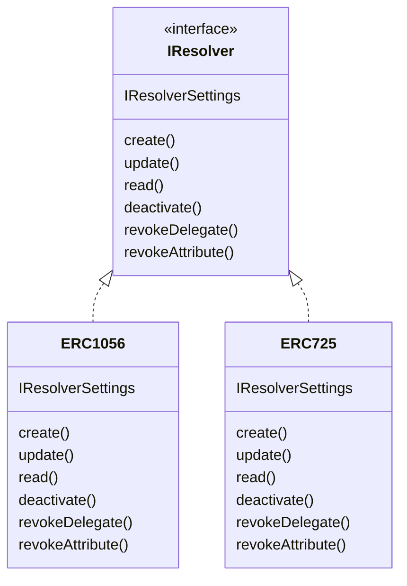

## DID Resolver Interface
EW-DID library has a design goal to support different DID methods. `did-document` allows management of keys, authorisation, delegation and service endpoints in standardised way. In the practical scenario, the CRUD behaviour of the `did-document` needs to be specific to the DID method's underlying implementation. EW-DID aims to handle this through the DID method specific resolver implementation. 

`did-resolver-interface` defines the contract required for CRUD behaviour of the `did-document`. [did-ethr-resolver](/packages/did-ethr-resolver) provides a reference implemention of ERC 1056 standard.

### Class Diagram


### Psedo example of implementation
```typescript
class Resolver implements IResolver{
    readAttribute(){
    // read an attribute as per did method requirement 
    }
    
    valiDelegate(){
    //validate a delegate as per did method requirement
    }

}

export class Operator extends Resolver implements IOperator {

    create(){
    //create specific to did method
    }

    update(){
    //update specific to did method
    }
    deactivate(){
    //deactivate specific to did method
    }
    revokeDelegate(){
    //revokeDelegate specific to did method
    }
    
    revokeAttribute(){
    //revoke attribute specific to did method
    }

}
```